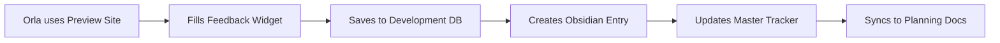

# 🔗 Obsidian Vault Integration Guide

This document explains how the development system integrates with the original Obsidian project planning vault to maintain project continuity and enable stakeholder feedback.

## 🎯 Integration Philosophy

Rather than abandoning the comprehensive Obsidian planning system, we've created a **bidirectional sync** that:
1. **Preserves** the original project documentation and decisions
2. **Extends** the planning with real-time development tracking
3. **Enables** stakeholder feedback to flow back into the planning system
4. **Maintains** project continuity between development sessions

---

## 📂 File Structure Integration

### Obsidian Vault Location
```
/home/developer/Documents/Obsidian Vault/01-Projects/Personal/OrlaMarieCoach-Website/
```

### Key Integration Points

#### 1. **Live Status Updates**
Files that are automatically updated from the development system:

- **`📋 PROJECT-OVERVIEW.md`** - Progress percentage, health status, milestones
- **`🎯 CURRENT-FOCUS.md`** - Real-time progress tracking, phase updates
- **`07-Tasks/LIVE-TASKS-TRACKER.md`** - Active tasks, completions, blockers
- **`Progress-Tracking/Daily-Updates/[date]-auto-update.md`** - Daily snapshots

#### 2. **Stakeholder Feedback Integration**
New files created from the feedback system:

- **`06-Meetings/Stakeholder-Feedback/[date]-feedback.md`** - Daily feedback entries
- **`STAKEHOLDER-FEEDBACK-TRACKER.md`** - Master feedback table
- **`Client-Review-Package/Real-Time-Feedback/`** - Structured feedback reports

#### 3. **Preserved Planning Documents**
Original files that remain the source of truth:

- **`DEVELOPMENT-ROADMAP-2025.md`** - Original approved analytics plan
- **`Analytics/Implementation-Plan.md`** - Technical implementation details
- **`PROJECT-REVIEW-CRITICAL-ANALYSIS.md`** - The analytics gap analysis
- **All client meeting notes and design decisions**

---

## 🔄 How the Integration Works

### 1. **Project Status Persistence**

**Development System (`/src/lib/project-status.ts`)**
```typescript
// Maintains real-time project state
interface ProjectStatus {
  currentPhase: string
  completionPercentage: number
  pendingTasks: TaskItem[]
  feedback: FeedbackItem[]
  analytics: AnalyticsStatus
  // ... more fields
}
```

**Obsidian Sync**
- Every task update triggers a sync to Obsidian
- Progress percentages are calculated in real-time
- Status changes update multiple Obsidian files automatically

### 2. **Stakeholder Feedback Flow**



**Example Feedback Entry:**
```markdown
## Feedback Item #feedback-1697569200000
**Time:** 10/17/2025, 3:20:00 PM  
**Page:** Homepage  
**Type:** design  
**Priority:** high  

### Description
The hero image feels too dark. Could we brighten it or use a different photo?

### Suggested Solution
Maybe the forest sunrise photo from the assets folder?

### Technical Details
- **URL:** https://orlamariecoach-preview.vercel.app/
- **Browser:** Mozilla/5.0...
- **Status:** new
```

### 3. **Real-Time Status Dashboard**

**Admin Dashboard (`/admin/status`)**
- Shows live project status
- Allows task status updates
- Processes feedback in real-time
- Syncs all changes back to Obsidian

---

## 🚀 Deployment & Preview Setup

### 1. **Development Environment**
```bash
# Local development with feedback widget
npm run dev
# Accessible at: http://localhost:3004
# Admin dashboard: http://localhost:3004/admin/status
```

### 2. **Preview Deployment (For Orla)**
```bash
# Deploy to Vercel preview
vercel --prod=false
# Creates URL like: https://orlamariecoach-preview.vercel.app
```

**Preview Features:**
- Feedback widget visible on every page
- Preview banner showing it's a test environment
- All feedback automatically syncs to Obsidian
- Real-time status dashboard accessible to developer

### 3. **Environment Variables for Preview**
```env
# Preview deployment settings
NEXT_PUBLIC_PREVIEW_MODE=true
NEXT_PUBLIC_FEEDBACK_ENABLED=true
DATABASE_URL=postgresql://... # Preview database
OBSIDIAN_SYNC_ENABLED=true
```

---

## 📋 Workflow for Orla's Feedback

### Step 1: Access Preview Site
Orla receives preview URL from developer:
```
🔗 Preview Site: https://orlamariecoach-preview.vercel.app
👀 Please review each page and share your thoughts
💭 Use the blue feedback button in the bottom-right corner
```

### Step 2: Provide Feedback
1. Browse the preview site on her devices (phone, tablet, laptop)
2. Click the feedback widget when she has comments
3. Fill out the structured feedback form:
   - **Page:** Automatically detected
   - **Element:** Optional (e.g., "Header navigation")
   - **Type:** Design/Content/Bug/Enhancement/General
   - **Priority:** Low/Medium/High/Critical
   - **Description:** What she likes/dislikes/wants changed
   - **Suggested Fix:** Optional ideas for improvement

### Step 3: Automatic Processing
The system automatically:
1. Saves feedback to the development database
2. Creates entries in Obsidian vault
3. Updates the master feedback tracker
4. Notifies developer via dashboard
5. Syncs with original project planning documents

### Step 4: Developer Response
Developer can:
1. View all feedback in the admin dashboard
2. Update feedback status (New → Reviewing → In Progress → Completed)
3. Implement changes and mark tasks complete
4. All updates sync back to Obsidian automatically

---

## 🔍 How This Preserves Original Planning

### 1. **Maintains Historical Context**
- All original planning decisions are preserved
- Analytics gap analysis remains visible
- Client meeting notes and decisions are untouched
- Design process documentation stays intact

### 2. **Extends Rather Than Replaces**
- New files supplement existing documentation
- Real-time tracking enhances static planning
- Feedback system builds on original client review process
- Progress tracking aligns with original milestones

### 3. **Enables Informed Decisions**
- Orla can see both original vision and current reality
- Feedback is contextualized within the broader project goals
- Progress tracking shows alignment with original timeline
- Decisions can reference both planning and implementation data

---

## 📊 Status Reporting Integration

### 1. **Real-Time Dashboard**
```
/admin/status
- Current progress (calculated from original scope)
- Task status aligned with Obsidian planning
- Feedback organized by priority and type
- Analytics implementation progress
- Blocker tracking from original analysis
```

### 2. **Obsidian Auto-Updates**
The system automatically updates:
```markdown
# In PROJECT-OVERVIEW.md
**Overall Progress:** 67% complete 📈 (Real-time tracking active)
**Current Phase:** Analytics Implementation Pending
**Next Milestone:** Analytics MVP Complete (5-7 weeks remaining)

# In CURRENT-FOCUS.md
*Last Updated: 10/17/2025, 3:20:00 PM (Auto-sync)*
**Current Overall Progress: 67%**
```

### 3. **Daily Status Reports**
Automatically generated in:
```
Progress-Tracking/Daily-Updates/2025-10-17-auto-update.md
```

---

## 🎯 Benefits of This Integration

### For Orla (Stakeholder)
1. **Familiar Process** - Builds on the original planning she approved
2. **Structured Feedback** - Easy, guided way to share thoughts
3. **Visible Progress** - Real-time updates on development
4. **Informed Decisions** - Context from original planning available

### For Developers
1. **Project Continuity** - No loss of original planning context
2. **Organized Feedback** - Structured input instead of scattered emails
3. **Progress Tracking** - Real-time status aligned with original goals
4. **Historical Record** - All decisions and changes documented

### For the Project
1. **Maintains Vision** - Original analytics plan and goals preserved
2. **Enables Iteration** - Feedback flows back into planning
3. **Reduces Miscommunication** - Single source of truth
4. **Supports Handoffs** - Future developers can see full context

---

## 🚦 Next Steps

### Immediate Setup (Next 24 hours)
1. **Deploy Preview Environment**
   ```bash
   vercel --prod=false
   ```

2. **Configure Feedback Widget**
   - Enable on all pages
   - Test submission flow
   - Verify Obsidian sync

3. **Share with Orla**
   - Send preview URL
   - Provide feedback instructions
   - Schedule review period

### Medium Term (Next week)
1. **Process Feedback**
   - Review submissions daily
   - Update task status in dashboard
   - Sync changes to Obsidian

2. **Iterate on Implementation**
   - Implement high-priority feedback
   - Update progress tracking
   - Maintain alignment with original vision

### Long Term (Following weeks)
1. **Complete Original Vision**
   - Use feedback to guide analytics implementation
   - Maintain progress tracking throughout
   - Deliver the complete project as originally planned

---

**The key insight:** This isn't about replacing the original planning system, but rather **bringing it to life** with real-time feedback and progress tracking that maintains the integrity and context of the original vision.

*Integration completed: October 17, 2025*